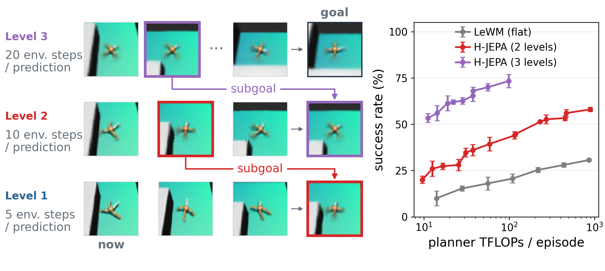

<h1 align="center">
    <p><b>H-JEPA: End-to-End Learning of Hierarchical World Models for Visual Planning</b></p>
</h1>

<div align="center" style="line-height: 1;">
  <a href="https://github.com/kevinghst/H-JEPA" target="_blank" style="margin: 2px;"></a>
  <a href="https://huggingface.co/datasets/jepa-world-models/h-jepa" target="_blank" style="margin: 2px;"></a>
  <a href="https://huggingface.co/jepa-world-models/h-jepa" target="_blank" style="margin: 2px;"></a>
  <!-- TODO: replace XXXX.XXXXX with the arXiv id (link and badge) -->
  <a href="https://arxiv.org/abs/XXXX.XXXXX" target="_blank" style="margin: 2px;"></a>
</div>

<br>

<p align="center">
  Wancong Zhang*,
  Basile Terver*,
  Mike Rabbat,
  Yann LeCun&dagger;,
  Randall Balestriero&dagger;
</p>

<p align="center">
  <b>AMI Labs</b>, NYU, INRIA Paris, Brown University<br>
  <sub>* equal contribution, &dagger; equal advising</sub>
</p>

<p align="center">
  
</p>

<p align="center"><sub><b>Left:</b> hierarchical planning in Visual AntMaze; each level's first predicted state becomes the subgoal of the level below. <b>Right:</b> AntMaze planning success versus planner compute, flat LeWM against two- and three-level H-JEPA.</sub></p>

---

Code to reproduce the planning results of the H-JEPA paper:

- the bottom row of the depth figure (`planning/depth_planning_combined`): planning success of flat
  LeWM, H-JEPA and HWM with 2, 3 and 4 levels on Visual AntMaze, FourRoom Distractors, OGBench Cube and
  Push-T, all with planners under 100 TFLOPs per episode;
- the level-1 planning columns of the cost-ladder tables (`tab:cost-ladder`, `tab:cost-ladder-appendix`):
  the H-JEPA level-1 planner with its cost measured in the level-2, 3 or 4 latent;
- the DROID planning figures (`fig:cls-ladder-droid`, `fig:compute-pareto-real`): Fréchet fidelity of
  LeWM + IDM, HWM and H-JEPA with 2 levels on DROID at 5 fps.

The code builds on [LeWM](https://github.com/lucas-maes/le-wm) and
[stable-worldmodel](https://github.com/galilai-group/stable-worldmodel), which is vendored in
`stable_worldmodel/` with the environments, solvers and planning policy used here.

## 1) Layout

```
stable_worldmodel/          environments, dataset loader, planning solvers and policy
scripts/data/               dataset collection (AntMaze, FourRoom) and Push-T utilities
h_jepa/
  main_hjepa.py             training (ends with a planning eval and a probing/decoding eval)
  eval.py                   standalone planning eval, every env (DROID: droid_eval.py)
  hierarchical_solver.py    hierarchical planner (one gradient solver per level, planned top-down)
  main_probing_decoding_eval.py   standalone probing/decoding eval
  models/                   JEPA levels, H-JEPA container, encoders, predictors
  config/train/             28 training configs: <env>_<model>.yaml (+ base/<env>.yaml),
                            3 DROID configs: droid_{lewm,hwm_l2,hjepa_l2}.yaml
  config/eval/              28 planning configs: <env>_<planner>.yaml, DROID: droid_{flat,l2}.yaml
  config/probing/           final probing/decoding configs, one per environment
  droid_data.py             DROID mp4 loader (training) and evaluation-clip reader
  droid_eval.py             offline DROID planning eval on the 16 evaluation clips (eval.py)
  droid_assets/             DROID normalization stats and evaluation-clip manifest
  scripts/                  eval-task generators and the train/eval helper scripts
  ARCHITECTURE.md           how training, the hierarchy and planning fit together
```

`<env>` is `ant`, `fourroom`, `cube` or `pusht`.

| Model (`config/train/<env>_<model>.yaml`) | |
|---|---|
| `lewm` | flat LeWM baseline (one level) |
| `hjepa_l2`, `hjepa_l3`, `hjepa_l4` | H-JEPA with 2/3/4 levels, trained end-to-end |
| `hwm_l2`, `hwm_l3`, `hwm_l4` | HWM baseline: identity upper encoders, no upper-level SIGReg |

| Planner (`config/eval/<env>_<planner>.yaml`) | |
|---|---|
| `flat` | flat level-1 planning (LeWM, and the native level-1 column of the cost ladder) |
| `l2`, `l3`, `l4` | 2/3/4-level hierarchical planning, shared by H-JEPA and HWM |
| `l2_project`, `l3_project`, `l4_project` | level-1 planning with the cost in the level-2/3/4 latent |

## 2) Installation

```bash
git clone https://github.com/kevinghst/H-JEPA.git && cd H-JEPA
conda create -n hjepa python=3.10 && conda activate hjepa
pip install -e ".[train,env]"
export HJEPA_HOME=/path/to/data   # datasets, expert policies and checkpoints live here
```

## 3) Usage

How to run each part of the pipeline. All commands run from `h_jepa/` unless noted.

### 3.1) Datasets

The simulation datasets are HDF5 files under `$HJEPA_HOME`; DROID is read from mp4 (§5.1).

| Environment | Files | Source |
|---|---|---|
| Push-T | `pusht_expert_train.h5`, `pusht_expert_val.h5` | download (LeWM + HF) |
| OGBench Cube | `cube_single_expert_train.h5`, `cube_single_expert_val.h5` | download (LeWM) + split |
| Visual AntMaze | `visual_antmaze_medium_{explore_stitch_train,stitch_val,probing_train,probing_eval}.h5` | download (HF) or generate |
| FourRoom Distractors | `fourroom_tp35_d1{,_val,_probing,_probing_val}.h5` | download (HF) or generate |
| DROID | `droid/droid_paths_minus16_256p.csv`, `droid/droid_val_indist_256p.csv`, the 256p mp4 episodes they list (`droid/droid_256p/`) and the 16 raw evaluation episodes (`droid/droid_raw/`) | download (HF `jepa-world-models/h-jepa`, §5.1) |

**Push-T and Cube.** The training data is LeWM's release
([`quentinll/lewm-pusht`](https://huggingface.co/datasets/quentinll/lewm-pusht),
[`quentinll/lewm-cube`](https://huggingface.co/datasets/quentinll/lewm-cube), MIT). The Push-T
validation set is in our release. From the repository root:

```bash
hf download quentinll/lewm-pusht --repo-type dataset --local-dir $HJEPA_HOME --include "*.zst"
hf download quentinll/lewm-cube --repo-type dataset --local-dir $HJEPA_HOME --include "*.zst"
hf download jepa-world-models/h-jepa pusht_expert_val.h5 --repo-type dataset --local-dir $HJEPA_HOME
unzstd $HJEPA_HOME/pusht_expert_train.h5.zst
tar -I unzstd -xf $HJEPA_HOME/cube_single_expert.tar.zst -C $HJEPA_HOME
python scripts/data/add_pusht_block_ori.py $HJEPA_HOME/pusht_expert_train.h5
python scripts/data/split_cube.py
```

`add_pusht_block_ori.py` adds the `block_ori` column (`[cos, sin]` of the block angle) that the
Push-T probing config reads; the validation file already has it. `split_cube.py` writes
`cube_single_expert_train.h5` (first 9,800 episodes) and `cube_single_expert_val.h5` (last 200);
the `.zst` archives and `cube_single_expert.h5` can be deleted afterwards. The Push-T validation
set was converted from DINO-WM's Push-T validation data with `scripts/data/convert_pusht_noise_to_h5.py`.

**Visual AntMaze and FourRoom Distractors.** Download the eight files from
[`jepa-world-models/h-jepa`](https://huggingface.co/datasets/jepa-world-models/h-jepa):

```bash
hf download jepa-world-models/h-jepa --repo-type dataset --local-dir $HJEPA_HOME \
  --include "visual_antmaze_medium_*" --include "fourroom_tp35_d1*" --include SHA256SUMS
cd $HJEPA_HOME && sha256sum -c --ignore-missing SHA256SUMS
```

or collect them (from the repository root):

```bash
bash scripts/data/collect_datasets.sh
```

AntMaze is collected by rolling out the OGBench AntMaze expert policies (`<LINK: OGBench expert
policies>`); put the ant expert in `$HJEPA_HOME/ogbench_experts/ant/` (`params_400000.pkl`,
`flags.json`). The script runs, per file, the collection config of the same name in
`scripts/data/config/`. Collected files follow the same distribution as the downloaded ones:

- FourRoom collections reproduce the downloaded files (identical in our checks).
- AntMaze collections are not byte-identical (part of the AntMaze reset randomness is not seeded). The
  downloaded training file (12,500 `explore` + 12,500 `stitch` episodes) is the training data of
  the seed-42 paper models and keeps only the columns training reads; a collected file also has the
  collector's other columns. The probing eval file holds 155 `explore` + 155 `stitch` episodes.

### 3.2) Generate evaluation tasks

Each environment has a fixed set of 50 start/goal tasks under `h_jepa/assets/eval_trajs/`.
Download them from [`jepa-world-models/h-jepa`](https://huggingface.co/datasets/jepa-world-models/h-jepa):

```bash
hf download jepa-world-models/h-jepa --repo-type dataset --local-dir assets --include "eval_trajs/*"
cd assets/eval_trajs && sha256sum -c SHA256SUMS && cd -
```

or regenerate them:

```bash
# Visual AntMaze: start/goal cells 3 grid cells apart, reached by the expert policy
# (needs the OGBench ant expert in $HJEPA_HOME/ogbench_experts/ant/, see 3.1)
python scripts/generate_maze_expert_grid_eval_tasks.py --config-name ant_flat \
  --output-path assets/eval_trajs/ant/expert_grid_d3_n50.pt \
  --d-low 3 --d-high 3 --num-episodes 50 --rollout-budget 125 --seed 42

# FourRoom Distractors: writes one file per active-distractor count; the evals use _d1
# (no dataset needed)
python scripts/generate_fourroom_eval_tasks.py \
  --data-config-path ../scripts/data/config/fourroom_tp35_d0to5.yaml \
  --output-dir assets/eval_trajs/fourroom --output-stem fourroom_tp35 \
  --cross-n-rooms 2 --max-steps 75 --num-episodes 50

# OGBench Cube: 20-step windows centred on the grasp, from the val split
# (needs cube_single_expert_val.h5, see 3.1)
python scripts/generate_dataset_eval_trajs.py --config-name cube_flat \
  --dataset-name cube_single_expert_val --traj-sampling-mode cube_pickup_centered \
  --goal-offset-steps 20 --eval-budget 50 --seed 42 \
  --output-path assets/eval_trajs/ogbench/goal_offset_20_pickup_val.pt

# Push-T: 75-step windows from the val split, stratified over episodes
# (needs pusht_expert_val.h5, see 3.1)
python eval.py --config-name pusht_flat policy=random load_eval_trajs_path=null \
  eval.goal_offset_steps=75 eval.dataset_name=pusht_expert_val seed=42 \
  dump_eval_trajs_path=assets/eval_trajs/pusht/goal_offset_75_val.pt
```

### 3.3) Training

```bash
python main_hjepa.py --config-name <env>_<model> seed=<seed>
```

On SLURM, one process per GPU (here 2) through `srun`; `--requeue` is safe, a restarted job resumes
from `<run_dir>/lightning_resume/last.ckpt`:

```bash
#!/bin/bash
#SBATCH --nodes=1 --ntasks-per-node=2 --gpus-per-node=2 --cpus-per-task=16 --mem=200G --requeue
source /path/to/.venv/bin/activate
cd /path/to/H-JEPA/h_jepa
export HJEPA_HOME=/path/to/hjepa_home PYTHONPATH=$PWD/..:$PWD MUJOCO_GL=egl
srun python main_hjepa.py --config-name droid_hjepa_l2 seed=1    # trainer.devices = 2 in base/droid
```

A run writes to `$HJEPA_HOME/ckpts/<env>/<env>_<model>/seed<seed>/` (`config.yaml`, logs and the
stable-pretraining cache `spt/` included):

- `<env>_<model>_object.ckpt`: the trained model;
- `planning_eval/epoch_XXXX/metrics.yaml`: the planning eval run at the end of training with the
  matching planner (`<env>_flat` for LeWM, `<env>_l<n>` for an n-level model), planner seed = model seed;
- `final_probing_decoding_eval/`: probes and decoders trained on the frozen model
  (`config/probing/<env>.yaml`).

W&B logging is off by default (`wandb.enabled=true` to turn it on).

### 3.4) Probing and decoding

Training ends with `final_probing_decoding_eval`. To run it on a saved checkpoint:

```bash
python main_probing_decoding_eval.py --config-name <env> \
  policy=$HJEPA_HOME/ckpts/<env>/<env>_<model>/seed<seed>/<env>_<model>_object.ckpt
```

### 3.5) Planning evaluation

To run a planner on a saved checkpoint:

```bash
python eval.py --config-name <env>_<planner> seed=<seed> output.dir=<dir> \
  policy=$HJEPA_HOME/ckpts/<env>/<env>_<model>/seed<seed>/<env>_<model>_object.ckpt
```

The eval writes `metrics.yaml` (`success_rate`) to `output.dir`, relative to the checkpoint's directory.
Use `flat` for `lewm` and `l<n>` for `hjepa_l<n>` and `hwm_l<n>`. The `l<k>_project` planners run
level-1 planning with the cost measured in the level-k latent (the upper levels are skipped; the planned
level-1 states and the goal are encoded up to level k); they apply to any H-JEPA model with at least k
levels, since planning levels above the model's depth are dropped.
With `+eval.chunk_size=N` the tasks are evaluated N at a time and each chunk writes
`chunks/tasks_<start>-<end>.json` to `output.dir`; a rerun skips the chunks already written, so a
preempted (requeued) eval only redoes the chunk it was in. `metrics.yaml` keeps the same keys; each chunk
reseeds the planner with the seed plus its first task index (a single chunk plans as the unchunked eval).

## 4) Reproducing Fourroom, Visual AntMaze, OGBench Cube, Push-T

This covers the bottom row of the depth figure and the level-1 columns of the cost-ladder tables. The
paper uses seeds 42, 43 and 44 for every model, with the planner seed equal to the model seed. Reference
numbers are success rates (%, mean ± SE over the three seeds).

### 4.1) Training

Train all 4 environments × 7 models × 3 seeds (84 runs):

```bash
scripts/train_all.sh
```

The runs are sequential; restrict them with `ENVS`, `MODELS` and `SEEDS` (e.g.
`ENVS=cube MODELS="lewm hjepa_l3" SEEDS=42 scripts/train_all.sh`), or on a cluster submit each
`main_hjepa.py` command as its own job.

### 4.2) Depth figure

Each training run ends with the planning eval behind the depth figure (flat planning
for LeWM, n-level planning for H-JEPA and HWM with n levels), so the numbers come out as a byproduct of
training:

```
$HJEPA_HOME/ckpts/<env>/          <env> in {ant, fourroom, cube, pusht}
  <env>_<model>/                    <model> in {lewm, hjepa_l2..4, hwm_l2..4}
    seed<seed>/                     <seed> in {42, 43, 44}
      <env>_<model>_object.ckpt
      planning_eval/epoch_XXXX/metrics.yaml    success_rate
      final_probing_decoding_eval/
```

`scripts/eval_depth.sh` re-runs the same evals from the saved checkpoints and writes
`<env>/<env>_<model>/seed<seed>/eval_<planner>/metrics.yaml`.

| | LeWM | H-JEPA 2 | H-JEPA 3 | H-JEPA 4 | HWM 2 | HWM 3 | HWM 4 |
|---|---|---|---|---|---|---|---|
| Visual AntMaze | 18.0 ± 3.5 | 39.3 ± 3.7 | 73.3 ± 3.5 | 67.3 ± 2.4 | 34.0 ± 1.2 | 38.7 ± 3.5 | 14.0 ± 2.0 |
| FourRoom Distractors | 40.7 ± 6.8 | 81.3 ± 6.7 | 96.0 ± 1.1 | 88.0 ± 2.3 | 75.3 ± 3.3 | 99.3 ± 0.7 | 92.7 ± 4.4 |
| OGBench Cube | 32.0 ± 6.1 | 47.3 ± 2.7 | 60.0 ± 5.0 | 62.7 ± 2.4 | 46.7 ± 2.9 | 53.3 ± 5.2 | 34.0 ± 3.1 |
| Push-T | 40.0 ± 2.3 | 45.3 ± 1.3 | 17.3 ± 3.5 | 0.7 ± 0.7 | 42.0 ± 6.4 | 12.0 ± 2.0 | 0.0 ± 0.0 |

The planner sample counts are the best mean success rate under 100 TFLOPs/episode from a sweep over
sample counts per level. Cube's 3- and 4-level planners keep the levels above 2 at horizon 1, so those
levels are skipped (2-level planning of a deeper model). No four-level compute sweep was run on Push-T,
so `pusht_l4` keeps the original planner setting.

### 4.3) Cost ladder

Evaluate every H-JEPA model with the flat level-1 planner (the native column) and
with the cost measured in each upper level's latent (`l2_project` … `l<n>_project` for an n-level model):

```bash
scripts/eval_cost_ladder.sh
```

`ENVS` and `SEEDS` restrict it as above. Each eval writes next to the checkpoint:

```
$HJEPA_HOME/ckpts/<env>/
  <env>_hjepa_l<n>/                 <n> in {2, 3, 4}
    seed<seed>/
      eval_flat/metrics.yaml        native L1
      eval_l2_project/metrics.yaml  L2 cost
      eval_l3_project/metrics.yaml  L3 cost (n >= 3)
      eval_l4_project/metrics.yaml  L4 cost (n = 4)
```

| | Model | Native L1 | L2 cost | L3 cost | L4 cost |
|---|---|---|---|---|---|
| Visual AntMaze | 2 levels | 23.3 ± 3.3 | 31.3 ± 2.7 | | |
| | 3 levels | 16.7 ± 1.8 | 20.7 ± 4.8 | 22.0 ± 2.3 | |
| | 4 levels | 10.0 ± 0.0 | 20.7 ± 1.8 | 21.3 ± 4.7 | 26.7 ± 2.9 |
| FourRoom Distractors | 2 levels | 9.3 ± 0.7 | 38.7 ± 6.6 | | |
| | 3 levels | 43.3 ± 8.7 | 65.3 ± 5.5 | 71.3 ± 4.1 | |
| | 4 levels | 68.7 ± 4.7 | 72.0 ± 3.1 | 66.0 ± 3.1 | 70.7 ± 2.7 |
| OGBench Cube | 2 levels | 24.0 ± 1.2 | 13.3 ± 0.7 | | |
| | 3 levels | 24.7 ± 1.3 | 28.0 ± 4.2 | 14.0 ± 3.5 | |
| | 4 levels | 26.7 ± 2.7 | 25.3 ± 2.4 | 12.0 ± 2.0 | 12.0 ± 2.3 |
| Push-T | 2 levels | 36.7 ± 1.8 | 38.0 ± 3.1 | | |
| | 3 levels | 30.7 ± 1.8 | 28.0 ± 4.0 | 24.7 ± 4.1 | |
| | 4 levels | 1.3 ± 0.7 | 1.3 ± 0.7 | 0.7 ± 0.7 | 1.3 ± 1.3 |

## 5) Reproducing DROID

This covers `fig:cls-ladder-droid` and the planner ladder of `fig:compute-pareto-real`. The paper uses
seeds 1, 1000 and 10000 for every model; each trained model is planned with planner seeds 1, 2 and 3.
Reference numbers are Fréchet fidelity (%, mean ± SE over the three train seeds, each the mean over
the three planner seeds).

### 5.1) Data

Download the DROID data (91 GB of tar shards, CC BY 4.0, see the dataset card) into
`$HJEPA_HOME/droid/` and unpack it in place:

```bash
hf download jepa-world-models/h-jepa --repo-type dataset --local-dir $HJEPA_HOME --include "droid/*"
bash $HJEPA_HOME/droid/extract.sh    # checks SHA256SUMS, untars the shards; --delete drops the tars
```

DROID episodes are mp4 files decoded with `decord` (`droid_data.py`), which resolves relative paths
against `$HJEPA_HOME/droid`. Training reads `droid_paths_minus16_256p.csv`: 74,896 episodes, all
of DROID 1.0.1 minus the 16 evaluation clips, re-encoded at 256x256 (`droid_256p/1.0.1/...`).
`droid_val_indist_256p.csv` (64 episodes) is the validation split used for monitoring. Both CSVs list
episode directories relative to `$HJEPA_HOME/droid`; set them with `data.dataset.name` and
`data.dataset.val_name` (`config/train/base/droid.yaml`; an absolute path also works).

`h_jepa/droid_assets/` holds the action/proprio normalization stats (`norm_stats_droid.json`, key
`full_fps5`) and the evaluation-clip manifest `droid_clips_waypoint_curated16v2_5fps_gw36.json`
(16 clips of 37 frames, goal 36 steps after the start), which reads the clips from the raw DROID
1.0.1 release (`droid_raw/1.0.1/...`, 1280x720, shipped as `droid_raw_eval16.tar`).

The models run at 5 fps (`data.fps: 5`, one step = 0.2 s). DROID mp4s are tagged 60 fps but hold
15 Hz footage, so the loader keeps every 3rd frame.

### 5.2) Training

Train 3 models × 3 seeds (9 runs):

```bash
ENVS=droid scripts/train_all.sh
```

| Config | Model | GPUs × batch | Epochs |
|---|---|---|---|
| `droid_lewm` | flat LeWM + IDM | 2 × 128 | 100 |
| `droid_hwm_l2` | HWM: identity level 2, trained end-to-end | 2 × 128 | 100 |
| `droid_hjepa_l2` | H-JEPA: latent-MLP level 2, trained end-to-end | 2 × 128 | 100 |

An epoch is 292 steps. Each run takes one process per GPU: the script launches
`srun --ntasks-per-node=2 python main_hjepa.py --config-name droid_<model> seed=<seed>`,
so run it inside a SLURM allocation with 2 GPUs and 2 tasks per node, or submit each command as its
own job. `MODELS` and `SEEDS` restrict it as in §4.1. A run writes:

```
$HJEPA_HOME/ckpts/droid/
  droid_<model>/                    <model> in {lewm, hwm_l2, hjepa_l2}
    seed<seed>/                     <seed> in {1, 1000, 10000}
      droid_<model>_object.ckpt     final model
      droid_<model>_epoch_<N>_object.ckpt   snapshot every save_every_n_epochs
```

### 5.3) Planning evaluation

`eval.py` with a DROID config (`droid_eval.py`) plans each evaluation clip start → goal in one open-loop
call and scores the planned actions against the ground-truth ones:

```bash
python eval.py --config-name droid_flat seed=<planner seed> output.dir=<dir> policy=<run>/droid_lewm_object.ckpt
python eval.py --config-name droid_l2 seed=<planner seed> output.dir=<dir> policy=<run>/droid_hjepa_l2_object.ckpt
python eval.py --config-name droid_l2 seed=<planner seed> output.dir=<dir> policy=<run>/droid_hwm_l2_object.ckpt
```

The planner settings are in `config/eval/droid_flat.yaml` (LeWM) and `config/eval/droid_l2.yaml`
(HWM and H-JEPA); any of them can be overridden on the command line (`solver.num_samples=<S>` flat,
`solver.solvers.level<k>.num_samples=<S>` hierarchical): AdamW on the actions, 90 iterations with early
stopping after 30 (patience 5 at 1%), weight decay 0.01, initial std 1.5, actions clipped to ±2σ in
normalized action space, horizon 36. Level 2 plans 12 steps and passes 12 subgoals to level 1 (weight
β = 0.5 on the intermediate subgoal costs).

The metric is Fréchet fidelity, 1 − F(planned, GT) / F(zero motion, GT), with F the discrete Fréchet
distance between cumulative xyz paths, averaged over the 16 clips. The eval writes to `output.dir`
(relative to the checkpoint's directory) `plan_config.yaml`, `ep_<k>/actions.pt` and
`ep_<k>/planning_compute.json` per clip and `eval.csv` (`frechet/skill_mean`) over every clip present, so
one-clip shards (`start_index=k num_eval=1`) can share one output dir.

| Model | Checkpoint | Config | S | η (level 1, level 2) | planner TFLOPs / episode |
|---|---|---|---|---|---|
| LeWM + IDM | `droid_lewm_object.ckpt` | `droid_flat` | 32 | 0.01 | 13.9 |
| HWM | `droid_hwm_l2_object.ckpt` | `droid_l2` | 16, 16 | 0.01, 0.3 | 11.4 |
| H-JEPA | `droid_hjepa_l2_object.ckpt` | `droid_l2` | 16, 16 | 0.01, 0.3 | 11.6 |

`scripts/eval_droid.sh` runs these cells with planner seeds 1, 2 and 3 on every trained model, writes
`droid/droid_<model>/seed<seed>/eval_{flat,l2}/plan_seed<ps>/eval.csv` and prints the mean ± SE per model.
The ladder of `fig:compute-pareto-real` is the same eval on the same checkpoints with only the number of
samples swept (per level for the two-level models), every other planner setting fixed as above.

| | Paper | This release |
|---|---|---|
| LeWM + IDM | 34.06 ± 1.26 | 32.52 ± 1.93 |
| HWM | 34.96 ± 0.32 | 33.67 ± 2.85 |
| H-JEPA | 39.95 ± 2.91 | 37.60 ± 1.98 |

Fréchet fidelity (%), mean ± SE over train seeds 1, 1000 and 10000 of the mean over planner seeds 1, 2 and 3.
"This release" uses the matched-compute cells of the table above (11-14 planner TFLOPs per episode) and the
release recipe (level-2 action SIGReg 0.005); "Paper" uses each model's own planner cell of the paper.

The LeWM bar without IDM in `fig:cls-ladder-droid` is the zero-action floor, not a trained model.

## 6) License

MIT (see `LICENSE`).
